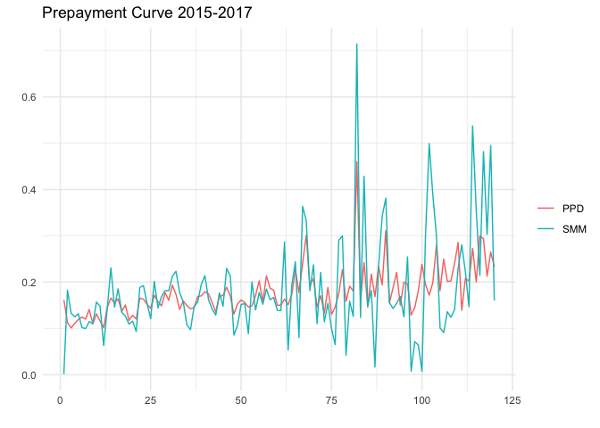

Curtailments
================
Luis Iberico
2023-01-10

``` r
require(rstan)
```

    FALSE Loading required package: rstan

    FALSE Loading required package: StanHeaders

    FALSE 
    FALSE rstan version 2.26.13 (Stan version 2.26.1)

    FALSE For execution on a local, multicore CPU with excess RAM we recommend calling
    FALSE options(mc.cores = parallel::detectCores()).
    FALSE To avoid recompilation of unchanged Stan programs, we recommend calling
    FALSE rstan_options(auto_write = TRUE)
    FALSE For within-chain threading using `reduce_sum()` or `map_rect()` Stan functions,
    FALSE change `threads_per_chain` option:
    FALSE rstan_options(threads_per_chain = 1)

``` r
require(tidyverse)
```

    FALSE Loading required package: tidyverse

    FALSE ── Attaching packages ─────────────────────────────────────── tidyverse 1.3.2 ──
    FALSE ✔ ggplot2 3.3.6      ✔ purrr   0.3.4 
    FALSE ✔ tibble  3.1.8      ✔ dplyr   1.0.10
    FALSE ✔ tidyr   1.2.1      ✔ stringr 1.4.1 
    FALSE ✔ readr   2.1.2      ✔ forcats 0.5.2 
    FALSE ── Conflicts ────────────────────────────────────────── tidyverse_conflicts() ──
    FALSE ✖ tidyr::extract() masks rstan::extract()
    FALSE ✖ dplyr::filter()  masks stats::filter()
    FALSE ✖ dplyr::lag()     masks stats::lag()

``` r
require(gtools)
```

    FALSE Loading required package: gtools

``` r
require(forecast)
```

    FALSE Loading required package: forecast
    FALSE Registered S3 method overwritten by 'quantmod':
    FALSE   method            from
    FALSE   as.zoo.data.frame zoo

``` r
rm(list=ls())

load("data.Rda")
load("TestData.Rda")
```

# Introduction

In this sample project I will show how to build a model for Mortgage
Curtailments, and proceed with the estimation of a prepayment curve. The
model will be trained using data from 2015 up to 2017, and tested using
data from 2018. In banking, the prepayment or behavioral curve is one of
the principal components in the Transfer Pricing (TP) -the price that
the treasury charges the business for the savings-. The TP is also one
of the principal components in the pricing -the price that the Bank
charges the clients-. I will use a sample of real data from a bank that
I wont disclose. Curtailments have a weird distribution. It has a high
concentration of 0’s, a smaller concentration of 1’s, and some density
in between. The model that I chose is the Zero One Inflated Beta, which
models the empirical distribution very well. The model is estimated in
stan (rstan package for r) and follows Ospina and Ferrari 2010.

# Data Description

The data that I am using has 14 features and one target (SMM), and has
information on every transaction of each mid to high income clients
between 2015 and 2017. Now, I will give a brief description of each
variable. The variables were previously chosen according to banking
experts and correlation analysis.

-   Salary: Monthly salary in PEN (national currency).
-   Age: Age (in years) of the client.
-   QProd: Total number of products that the client holds.
-   ActBal: Active Balance is the total amount of loan that a client
    holds.
-   PassBal: Passive Balance is the total amount of savings that a
    client holds.
-   SOW: Share of Wallet is the proportion (%) of loans that the client
    holds in this bank with respect to the complete banking system.
-   Loan: Total amount of the mortgage loan.
-   Rate: Rate of the mortgage loan.
-   Maturity: Time (in months) since the start of the mortgage loan.
-   Maturity2: Squared maturity.
-   DD: The Domestic Demand measures the annualized growth in economic
    activity of the country (Private and Public expenditure).
-   CPI: Consumer Price Index measures the annualized increment in
    prices.
-   HPI: House Price Index measures the annualized increment in housing
    prices.
-   Date: year-month.
-   SMM: Curtailments measured as Single Monthly Mortality (SMM) rate.
    The SMM will be introduced in the next section.

Here is a table that will help understand the structure of the data.

``` r
str(DF_train)
```

    FALSE tibble [3,064 × 15] (S3: tbl_df/tbl/data.frame)
    FALSE  $ Salary   : num [1:3064] 7670 4534 12000 13163 30000 ...
    FALSE  $ Age      : num [1:3064] 38 35 29 40 42 32 50 38 39 43 ...
    FALSE  $ QProd    : num [1:3064] 5 2 4 5 5 4 5 7 6 3 ...
    FALSE  $ ActBal   : num [1:3064] 17500 0 169950 194617 240585 ...
    FALSE  $ PassBal  : num [1:3064] 28322 25845 2556 26135 1105 ...
    FALSE  $ SOW      : num [1:3064] 1 0.897 1 1 0.993 ...
    FALSE  $ Loan     : num [1:3064] 87900 67860 160000 220320 310000 ...
    FALSE  $ Rate     : num [1:3064] 15.28 11.51 8.97 9.38 8.68 ...
    FALSE  $ Maturity : num [1:3064] 15 35 20 16 47 32 85 1 54 15 ...
    FALSE  $ Maturity2: num [1:3064] 225 1225 400 256 2209 ...
    FALSE  $ DD       : num [1:3064] -2.488 -3.592 1.449 -0.423 -0.76 ...
    FALSE  $ CPI      : num [1:3064] 3.91 3.25 3.37 4.3 3.07 ...
    FALSE  $ HPI      : num [1:3064] -0.0274 0.0513 -0.0565 -0.0569 -0.0045 ...
    FALSE  $ Date     : num [1:3064] 201604 201702 201505 201603 201501 ...
    FALSE  $ SMM      : num [1:3064] 1 1 0 0.0942 0 ...

# Curtailments

A curtailment is any additional payment that clients make on their
mortgage loans. There are two types of curtailments: partial curtailment
and full curtailment. A full curtailment means the client payed the full
loan. Also, a curtailment can aim to reduce the terms of the loan, or to
decrease the monthly payment. This affects the estimation of the
Transfer Pricing, but we will ignore them in sake of simplicity.

In this project we measure the curtailment as the Single Monthly
Mortality. This is a ratio of the monthly prepayment by the principal.
You can find more information on this ratio in
[investopedia](https://www.investopedia.com/terms/p/principal.asp).

In short, SMM takes the value of 0 if there is no curtailment, 1 if
there is a full curtailment, and some number between 0 and 1 if there is
a partial curtailment. In practice, not many clients make partial
curtailments, and even less clients make full curtailments, so we have a
high concentration of 0’s in the distribution. After doing some
research, I came upon a mixture model that can represent this
distribution. This model is known as the Zero One Inflated Beta or ZOIB
model.

# ZOIB Model

This model consist of a beta model inflated in 0 and 1. This is a
mixture model of 3 processes. The first process distinguish if the value
is categorical (0 or 1) or continuous (0,1), a binomial density. The
second process distinguish if the value, given that its a categorical
number, is 0 or 1, another binomial density. And the third process
estimates the beta density for the continuous part. Each process can be
understood as a model on its own, and this three models run
simultaneously, each with its own predictors. For simplicity, I will use
the same predictors on each mixture. a great paper with much more
information on ZOIB and ZIB models is this one [Opsina & Ferrari
2010](http://dx.doi.org/10.1007/s00362-008-0125-4).

As an example, lets sample from a ZOIB distribution. Let $\alpha$ be the
mean parameter for the first binomial component (categorical or
continuous), $\gamma$ is the mean parameter for the second binomial
component (0 or 1), and $[b_1, b_2]$ the shape parameters of the beta
component. The empirical distribution or curtailments has a high
concentration of values around 0, so we set $\alpha = 0.7$. The amount
of full curtailments is very low, but noticeable, so we set
$\gamma = 0.1$. Finally, we have a beta (1,2) distribution.

``` r
n <- 1000
alpha <- 0.7
gamma <- 0.1
b1 <- 1
b2 <- 2
rzoib <- function(n,alpha,gamma,b1,b2){
  categorical <- rbinom(n,1,alpha)
  one <- rbinom(n,1,gamma)
  ZOIB = rbeta(n,b1,b2)
  ZOIB[categorical*one==1] <- 1
  ZOIB[categorical==1&one==0] <- 0
  return(ZOIB)
}
set.seed(42)
plot(
ggplot(,aes(x=rzoib(n,alpha,gamma,b1,b2)))+
  geom_density(fill="navy",color="black",alpha=.3)+
  theme_minimal()+
  labs(x="",y="",title = "Zero One Inflated Beta")+
  theme(axis.text.y=element_blank(),
        axis.ticks.y=element_blank()))
```

<!-- -->

# Model Fit

The stan code for this ZOIB models is quite large because we have
several parameters, and we also want to test the out of sample
performance of the model, so we have add that to the sampler. I will
break it down in 5 parts.

## Data

Here we declare all the data objects that we are going to use. We need
to declare the number of observations (N), the number of features (F),
the feature matrix (X), and the target (Y). Also, for the out of sample
prediction, we specify the same arguments excluding Y.

## Parameters

Here we declare all the priors and hyper priors that we will use. For
each parameter of all the components (4 in total) we specify the gamma
and tau hyper priors, and a set of priors for the coefficients. We have
4 components in total: alpha for the mean of the first binomial
component, gamma for the mean of the second binomial component, mu for
the mean of the beta distribution, and phi for the precision parameter
of the beta distribution. It is easier to think of a model on the mean
rather than the scale parameters, so we set the model like this and
re-parametrise later on.

## Transformed Parameters

Here we declare and calculate the parameters alpha (from the first
binomial component), gamma (from the second binomial component), mu
(mean of beta), phi (precision of beta), p (first scale of beta), and q
(second scale of beta). It is worth noticing that the first three
components and the mean of the beta are estimated with a logit link, and
the precision is estimated with a log link. The inverse of the link
functions are used to estimated the parameters. This is done for the fit
and the out of sample prediction.

## Model

Here we populate the hyper priors and priors, and estimate the ZOIB
model.

## Generated Quantities

Here we sample Y_fit from the posterior predictive distribution, and we
also sample Y_pred which is the output of sample prediction.

``` r
ZOIB <- "
data {
  // Fit
  int N;  // N of Obs
  int F;  // N of Features
  matrix[N,F] X; // Matrix of Features
  vector<lower=0, upper=1>[N] Y;
  // Predict
  int N_pred;  // N of Obs
  int F_pred;  // N of Features
  matrix[N_pred,F_pred] X_pred; // Matrix of Features

}

parameters {
  // Hyper Priors
  vector[F] gamma;
  vector<lower=0>[F] tau;
  
  // alpha function
  vector[F] coef_a; //population-level regression coefficients

  // gamma function
  vector[F] coef_g; //population-level regression coefficients

  // mu function
  vector[F] coef_m; //population-level regression coefficients

  // phi function
  vector[F] coef_p; //population-level regression coefficients
}

transformed parameters {
  // Fit
  vector<lower=0, upper=1>[N] p1;
  vector<lower=0, upper=1>[N] p2;
  vector[N] mu;
  vector<lower=0>[N] phi;
  vector<lower=0>[N] p;
  vector<lower=0>[N] q;
  
  // Predict
  vector<lower=0, upper=1>[N_pred] p1_pred;
  vector<lower=0, upper=1>[N_pred] p2_pred;
  vector[N_pred] mu_pred;
  vector<lower=0>[N_pred] phi_pred;
  vector<lower=0>[N_pred] p_pred;
  vector<lower=0>[N_pred] q_pred;

  // Compute the linear predictor using relevant group-level regression coefficients
  
    // Fit
    p1 = inv_logit(X * coef_a);
    p2 = inv_logit(X * coef_g);
    mu = inv_logit(X * coef_m);
    phi = exp(X * coef_p);
    p = mu .* phi;
    q = phi - mu .* phi;
    
    // Pred
    p1_pred = inv_logit(X_pred * coef_a);
    p2_pred = inv_logit(X_pred * coef_g);
    mu_pred = inv_logit(X_pred * coef_m);
    phi_pred = exp(X_pred * coef_p);
    p_pred = mu_pred .* phi_pred;
    q_pred = phi_pred - mu_pred .* phi_pred;

}

model {
  // Hyper priors
  gamma ~ normal(0,5);
  tau ~ cauchy(0,2.5);

  // Fill the matrix of group-level regression coefficients
  
   coef_a ~ normal(gamma,tau); 
   coef_g ~ normal(gamma,tau); 
   coef_m ~ normal(gamma,tau); 
   coef_p ~ normal(gamma,tau);  
  
  
  
  // zero one inflated beta likelihood
  for (i in 1:N) {
    if (Y[i] == 0) {
      target += log(p1[i]) + log1m(p2[i]);
    } else if (Y[i] == 1) {
      target += log(p1[i]) + log(p2[i]);
    } else {
      target += log1m(p1[i]) + beta_lpdf(Y[i] | p[i], q[i]);
    }
  }
}


generated quantities {
  
  vector[N] y_est;
  real is_cat;
  real is_1;

  for (i in 1:N) {
  is_cat = binomial_rng(1, p1[i]);
  is_1 = binomial_rng(1, p2[i]);
  
    if (is_cat == 1) {
      if (is_1 == 0) {
        y_est[i] = 0;
      }
      else {
        y_est[i] = 1;
      }
    } else {
      y_est[i] = beta_rng(p[i], q[i]);
    }
  }
  
  vector[N_pred] y_pred;
  real is_cat_pred;
  real is_1_pred;

  for (i_pred in 1:N_pred) {
  is_cat_pred = binomial_rng(1, p1_pred[i_pred]);
  is_1_pred = binomial_rng(1, p2_pred[i_pred]);

    if (is_cat_pred == 1) {
      if (is_1_pred == 0) {
        y_pred[i_pred] = 0;
      }
      else {
        y_pred[i_pred] = 1;
      }
    } else {
      y_pred[i_pred] = beta_rng(p_pred[i_pred], q_pred[i_pred]);
    }
  }

  
  
  
}

"
```

After writing the stan code, we create the data objects that will fill
the model.

``` r
# Fit
X <- DF_train%>%transmute(Intercept=1,Salary, QProd, ActBal, PassBal, Loan, 
                          Rate, Maturity, Maturity2, DD, CPI, HPI)
X <- as.matrix(scale(X))
X[,"Intercept"] <- 1
Y <- DF_train%>%pull(SMM)
# Out of sample prediction
X_pred <- DF_test%>%transmute(Intercept=1,Salary, QProd, ActBal, PassBal, Loan, 
                              Rate, Maturity, Maturity2, DD, CPI, HPI)
X_pred <- as.matrix(scale(X_pred))
X_pred[,"Intercept"] <- 1
Y_pred <- DF_test%>%pull(SMM)
```

And here we fit the stan model. We will keep it short to avoid higher
computing times, so we use 1,000 samples and 4 chains.

``` r
iter <- 1000
chains <- 4
zoibFit <- stan(model_code = ZOIB,
                data = list(N = nrow(X), N_pred=nrow(X_pred),
                            F=ncol(X), F_pred=ncol(X_pred),
                            X=X, X_pred=X_pred,Y=Y),
                iter=iter,
                chains = chains,
                cores=4,
                init=0)
```

    FALSE Trying to compile a simple C file

# Posterior Inference

Here, I build a function to give a better structure to the samples from
the stanfit.

``` r
list_of_draws <- rstan::extract(zoibFit)

posteriorDraws_fun <- 
function(s,c,varlist,draws){
  n <- c*s
  nvar <- length(varlist)
  PosteriorDraws <- matrix(NA,nrow=(n),ncol=(nvar+2))
  PosteriorDraws[,1:nvar] <- draws
  PosteriorDraws[,(nvar+1)] <- rep(c(1:s),c)
  PosteriorDraws[,(nvar+2)] <- c(rep(1,s),rep(2,s),rep(3,s),rep(4,s))
  colnames(PosteriorDraws) <- c(varlist,"Sample","chain")
  PosteriorDraws <- as.data.frame(PosteriorDraws)
  return(PosteriorDraws)
}
varlist <- c("Intercept","Salary", "QProd", "ActBal", "PassBal", "Loan", "Rate", "Maturity", "Maturity2", "DD", "CPI", "HPI")
s <- iter/2

Alpha_posterior <- 
posteriorDraws_fun(s=s,c=chains,varlist=varlist,draws=list_of_draws$coef_a)
Gamma_posterior <- 
posteriorDraws_fun(s=s,c=chains,varlist=varlist,draws=list_of_draws$coef_g)
Mu_posterior <- 
posteriorDraws_fun(s=s,c=chains,varlist=varlist,draws=list_of_draws$coef_m)
```

After fitting the model, the first thing that we have to check is that
the samples are not autocorrelated. This can be done graphically by
analysing the trace plot. In short, we want to see white noise in the
plots for each chain. Then, we can also check the posterior distribution
of the coefficients. I define two functions that will plot the graphs
for me.

``` r
trace_plot <- function(df){
  p <- 
  df%>%
  pivot_longer(!c("Sample","chain"))%>%
  ggplot(aes(x=Sample,y=value,color=as.factor(chain)))+
  geom_line(alpha=0.4)+facet_wrap(~name,scales = "free")+
  labs(color="Chain",x="",y="")
  return(p)
}

density_plot <- function(df){
  p <- 
  df%>%
  pivot_longer(!c("Sample","chain"))%>%
  ggplot(aes(x=value))+
  geom_density(alpha=0.4,fill="navy")+facet_wrap(~name,scales = "free")+
    labs(x="",y="")
  return(p)
}
```

There are a lot of parameters, so I will focus on the mean fucntion of
the beta distribution. We can see from the plot that the chains look
mostly the same for each variable, and that the samples do not have
autocorrelation. In a similar manner, the posterior distribution is
unimodal an resembles a normal distribution. The other parameters have
very similar characteristics.

### Traceplots Mean Function (Beta)

``` r
plot(trace_plot(Mu_posterior))
```

<!-- -->

### Density Mean Function (Beta)

``` r
plot(density_plot(Mu_posterior))
```

<!-- -->

## Interpretation

This model has three components, so I will split the interpretation in
those. Note that we have use the same features to model each component,
but you can also have different functions for each component. Also,
another way of analysing the convergence of your samples is by using the
Rhat. If chains have mixed well, then you will have an Rhat closer to 1.
More information on the Rhat can be found
[here](https://mc-stan.org/rstan/reference/Rhat.html).

### Alpha component

The alpha component is the binomial distribution that samples between a
categorical (1, 0) or continuous output. A negative coefficient is
interpreted as being more likely to have a partial curtailment, so
clients with higher loans and rates, for example, are more likely to
have partial curtailments at some point. Also, an accelerated economic
activity is followed with more partial curtailments.

``` r
alpha_summary <- summary(zoibFit, pars = c("coef_a"), probs = c(0.025, 0.975))$summary
rownames(alpha_summary) <- varlist


print(alpha_summary)
```

    FALSE                   mean     se_mean         sd        2.5%       97.5%     n_eff
    FALSE Intercept  0.768345968 0.001143299 0.04193517  0.68648746  0.84901048 1345.3550
    FALSE Salary     0.042015375 0.001316745 0.05227146 -0.04938150  0.15227501 1575.8891
    FALSE QProd     -0.152989521 0.001008356 0.04265257 -0.23558685 -0.07037280 1789.2157
    FALSE ActBal     0.426160404 0.001774855 0.06447298  0.30585368  0.54607671 1319.5623
    FALSE PassBal    0.162020705 0.001255092 0.05312224  0.06363203  0.27272776 1791.4382
    FALSE Loan      -0.429782285 0.001594462 0.05735336 -0.54485505 -0.32171086 1293.8660
    FALSE Rate      -0.022169491 0.001696719 0.04623001 -0.11084073  0.06522367  742.3829
    FALSE Maturity   0.951682118 0.006352474 0.16678777  0.65616879  1.29900106  689.3544
    FALSE Maturity2 -0.304580877 0.006552578 0.17381511 -0.65880168  0.01385173  703.6403
    FALSE DD         0.017961584 0.001158553 0.03363459 -0.04489795  0.08863709  842.8313
    FALSE CPI       -0.009064043 0.001388306 0.04238625 -0.09033578  0.07763868  932.1363
    FALSE HPI       -0.179519218 0.001183904 0.04345309 -0.26609130 -0.09105620 1347.1263
    FALSE                Rhat
    FALSE Intercept 0.9996621
    FALSE Salary    0.9994735
    FALSE QProd     1.0008529
    FALSE ActBal    1.0020445
    FALSE PassBal   0.9999201
    FALSE Loan      1.0021339
    FALSE Rate      1.0050605
    FALSE Maturity  1.0027704
    FALSE Maturity2 1.0019771
    FALSE DD        1.0010115
    FALSE CPI       0.9991292
    FALSE HPI       0.9999620

### Gamma component

The gamma component is the binomial distribution that samples between a
full prepayment (1) or no prepayment (0). A positive coefficient is
interpreted as being more likely to have a full prepayment, conditional
on being a “categorical” draw. Then, for example, higher housing prices
(HPI) are usually followed by more full curtailments, but higher
consumer prices (more inflation), is followed by less curtailments.

``` r
gamma_summary <- summary(zoibFit, pars = c("coef_g"), probs = c(0.025, 0.975))$summary
rownames(gamma_summary) <- varlist


print(gamma_summary)
```

    FALSE                   mean     se_mean         sd        2.5%       97.5%     n_eff
    FALSE Intercept -3.640145897 0.005814294 0.19848191 -4.03677644 -3.26218874 1165.3270
    FALSE Salary     0.237610200 0.001642962 0.06715366  0.12018787  0.39008283 1670.6448
    FALSE QProd     -0.298782403 0.002664677 0.09250060 -0.47718965 -0.12252954 1205.0357
    FALSE ActBal    -3.533194661 0.008306979 0.27802249 -4.08183507 -3.00463569 1120.1434
    FALSE PassBal    0.379014547 0.002415993 0.10106876  0.18183334  0.57889916 1750.0175
    FALSE Loan       0.569403358 0.003242144 0.12927330  0.31992908  0.82104840 1589.8385
    FALSE Rate       0.091100064 0.007074518 0.11947573 -0.05129189  0.41832959  285.2106
    FALSE Maturity  -0.195766692 0.011372030 0.28774779 -0.82660494  0.33552296  640.2477
    FALSE Maturity2  0.044373016 0.009859344 0.24425817 -0.39390168  0.56509617  613.7651
    FALSE DD        -0.007280552 0.001953909 0.05470978 -0.13748275  0.09080276  784.0092
    FALSE CPI       -0.225447986 0.003375620 0.09479163 -0.40652764 -0.03616521  788.5566
    FALSE HPI        0.473695162 0.003052031 0.09817701  0.28205211  0.66833216 1034.7649
    FALSE                Rhat
    FALSE Intercept 1.0027952
    FALSE Salary    0.9990483
    FALSE QProd     1.0055200
    FALSE ActBal    0.9999180
    FALSE PassBal   1.0025251
    FALSE Loan      1.0001143
    FALSE Rate      1.0048046
    FALSE Maturity  1.0028319
    FALSE Maturity2 1.0027724
    FALSE DD        1.0014502
    FALSE CPI       1.0029611
    FALSE HPI       1.0004142

### Beta component

The beta component is the beta distribution that samples partial
curtailments. A positive coefficient is interpreted as having a higher
curtailment, conditional on “having a curtailment”. Then, for example,
clients with higher salaries and more savings have higher curtailments,
while clients with more debts (on other products) have lower
curtailments. Also, more expensive loans (higher rates) are correlated
with higher curtailments.

``` r
mu_summary <- summary(zoibFit, pars = c("coef_m"), probs = c(0.025, 0.975))$summary
rownames(mu_summary) <- varlist


print(mu_summary)
```

    FALSE                   mean      se_mean         sd         2.5%       97.5%
    FALSE Intercept -1.060629835 0.0011468977 0.04009963 -1.138911333 -0.97957955
    FALSE Salary     0.262460719 0.0014560330 0.05002524  0.166179378  0.35973571
    FALSE QProd      0.111754109 0.0008897933 0.03641267  0.041040673  0.18316528
    FALSE ActBal    -0.465776517 0.0016417283 0.05560795 -0.571392738 -0.35488869
    FALSE PassBal    0.146422138 0.0011659611 0.04478158  0.061561600  0.23754890
    FALSE Loan       0.062139926 0.0011666226 0.03625016 -0.009713996  0.13135535
    FALSE Rate       0.044970887 0.0008581392 0.02242591 -0.010175145  0.08132289
    FALSE Maturity   0.143373437 0.0053219917 0.13035454 -0.130532768  0.37891293
    FALSE Maturity2  0.059898271 0.0059003556 0.14500232 -0.210952835  0.35036409
    FALSE DD        -0.007889569 0.0009596287 0.02966522 -0.071951234  0.04581603
    FALSE CPI        0.047610877 0.0010865339 0.03688598 -0.018748071  0.12232764
    FALSE HPI       -0.016215745 0.0010989223 0.03744450 -0.089313181  0.05927778
    FALSE               n_eff      Rhat
    FALSE Intercept 1222.4506 1.0011409
    FALSE Salary    1180.4183 0.9988959
    FALSE QProd     1674.6603 0.9990319
    FALSE ActBal    1147.2847 0.9997349
    FALSE PassBal   1475.1313 1.0007506
    FALSE Loan       965.5152 1.0014316
    FALSE Rate       682.9432 1.0009797
    FALSE Maturity   599.9347 1.0030384
    FALSE Maturity2  603.9397 1.0019177
    FALSE DD         955.6280 1.0013148
    FALSE CPI       1152.4870 1.0037912
    FALSE HPI       1161.0263 1.0025268

# Posterior Simulations

In this final section we analyse the fit and out of sample performance
of the model. The first plot is the posterior distribution of the
curtilments (SMM). This shows how the posterior distributions are
similar to the observed.

``` r
Y_ppd <- t(list_of_draws$y_est)
Y_ppd_mean <- rep(0,nrow(Y_ppd))
for(i in 1:nrow(Y_ppd)){
  Y_ppd_mean[i] <- mean(Y_ppd[i,],na.rm = T)
}

Y_ppd_s <- as.data.frame(Y_ppd[,1:100])%>%
  mutate(Maturity = DF_train$Maturity)%>%
  pivot_longer(!Maturity)

  plot(ggplot()+
  geom_density(data=Y_ppd_s,aes(x=value,color=name),alpha=0.5,size=0.5)+
  geom_density(aes(x=DF_train$SMM),alpha=0.5,size=0.5,color="red")+
  theme_minimal()+
  scale_color_manual(values=rep("gray",100))+
  theme(legend.position = "none")+
  labs(title="Posterior Predictive Distribution, SMM",x="",y=""))
```

<!-- -->

Anyway, what we really needs is the prepayment curve. This is, on each
month of maturity, how much was the curtailment. This next plot compares
the observed prepayment curve with the curve from the mean PPD. Both are
quite noisy, but are very similar.

``` r
plot(DF_train%>%
  transmute(Maturity,SMM,PPD=Y_ppd_mean)%>%
  group_by(Maturity)%>%
  summarise_all(mean)%>%
  pivot_longer(!Maturity)%>%
  ggplot()+geom_line(aes(x=Maturity,color=name,y=value))+
  theme_minimal()+
  labs(x="",y="",color="",title = "Prepayment Curve 2015-2017"))
```

<!-- -->

In a similar way, here is the density plot for the our of sample data
(2018). The fit is not perfect, and we can clearly see that we are
overestimating the amount of 0’s in the model.

``` r
Y_ppd_fc <- t(list_of_draws$y_pred)
Y_ppd_mean_fc <- rep(0,nrow(Y_ppd_fc))
for(i in 1:nrow(Y_ppd_fc)){
  Y_ppd_mean_fc[i] <- mean(Y_ppd_fc[i,],na.rm = T)
}

Y_ppd_fc_s <- as.data.frame(Y_ppd_fc[,1:100])%>%
  mutate(Maturity = DF_test$Maturity)%>%
  pivot_longer(!Maturity)

  plot(ggplot()+
  geom_density(data=Y_ppd_fc_s,aes(x=value,color=name),alpha=0.5,size=0.5)+
  geom_density(aes(x=DF_test$SMM),alpha=0.5,size=0.5,color="red")+
  theme_minimal()+
  scale_color_manual(values=rep("gray",100))+
  theme(legend.position = "none")+
  labs(title="Posterior Predictive Distribution 2018, SMM",x="",y=""))
```

<!-- -->

And here is the comparison between the predictions for 2018 and the real
prepayment curve of that year. Again, we can see that the predictions
are not perfect, but they do a good job on predicting the future.

``` r
plot(DF_test%>%
  transmute(Maturity,SMM,PPD=Y_ppd_mean_fc)%>%
  group_by(Maturity)%>%
  summarise_all(mean)%>%
  pivot_longer(!Maturity)%>%
  ggplot()+geom_line(aes(x=Maturity,color=name,y=value))+
  theme_minimal()+
  labs(x="",y="",color="",title = "Prepayment Curve 2018"))
```

<!-- -->

## Predictive Performance

Finally, we can measure how good we are at predicting the prepayments of
the following year. I choose to use the Mean Absolute Error (MAE) to
avoid over weighting outliers, and I also compute the Mean Relative
Absolute Error (MRAE) which is just the MAE divided by the mean value of
the target (SMM). As expected, the forecast error is higher than the fit
error, but it is a more reasonable measurement for future forecasts.

``` r
DF_train%>%
  transmute(Maturity,SMM,PPD=Y_ppd_mean)%>%
  group_by(Maturity)%>%
  summarise_all(mean)%>%
  mutate(DF = "Train")%>%
  bind_rows(
  DF_test%>%
  transmute(Maturity,SMM,PPD=Y_ppd_mean_fc)%>%
  group_by(Maturity)%>%
  summarise_all(mean)%>%
  mutate(DF = "Test"))%>%
  ungroup()%>%group_by(DF)%>%
  transmute(MAE = abs(SMM-PPD),SMM)%>%
  summarise(MAE = mean(MAE),SMM=mean(SMM))%>%
  mutate(MRAE = MAE/SMM)
```

    FALSE # A tibble: 2 × 4
    FALSE   DF       MAE   SMM  MRAE
    FALSE   <chr>  <dbl> <dbl> <dbl>
    FALSE 1 Test  0.134  0.223 0.598
    FALSE 2 Train 0.0579 0.183 0.316
